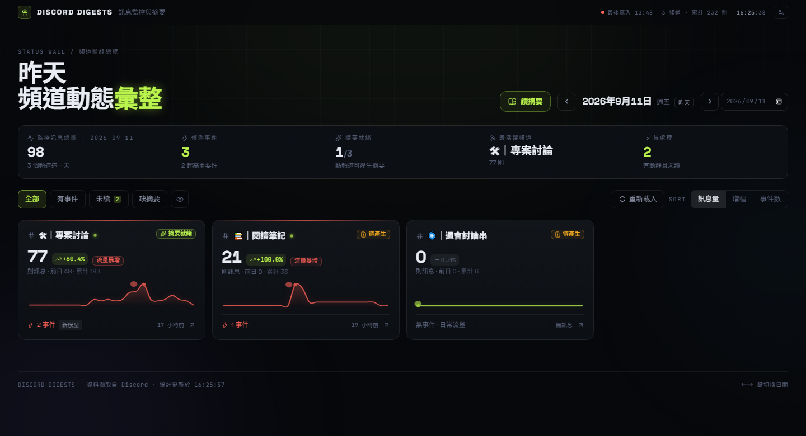
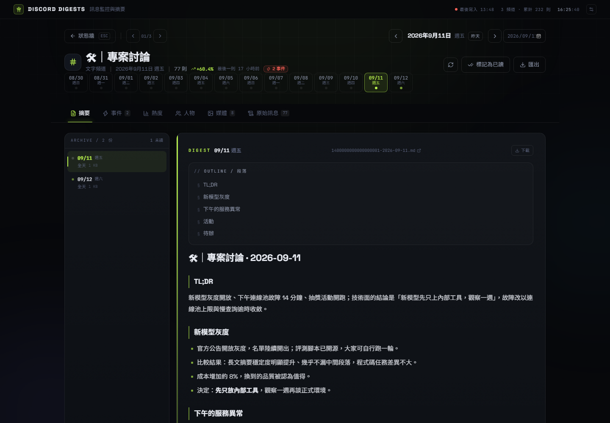
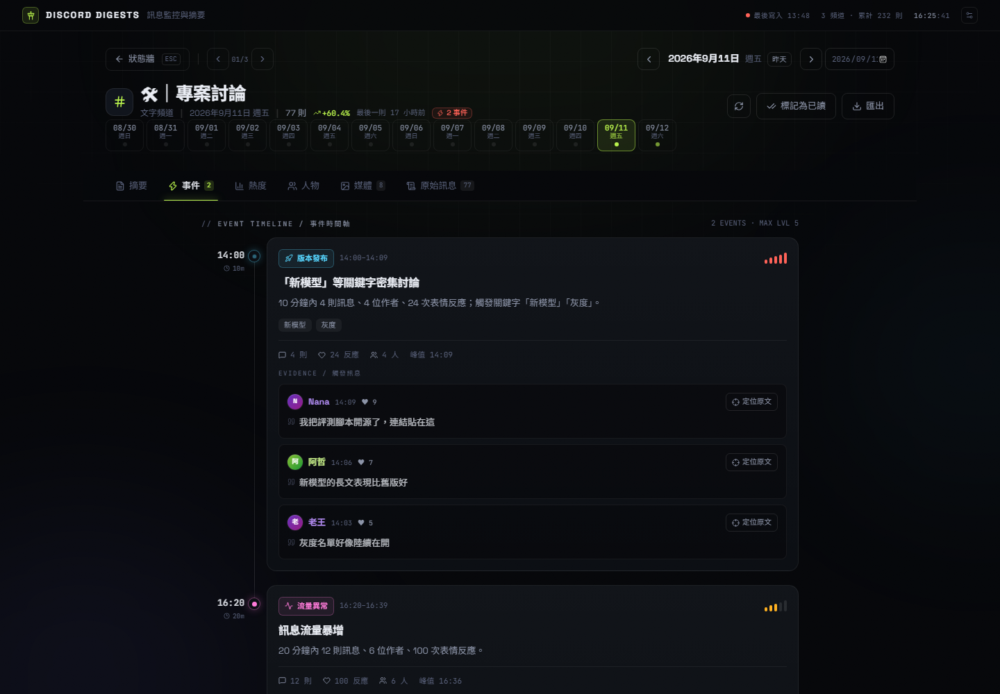
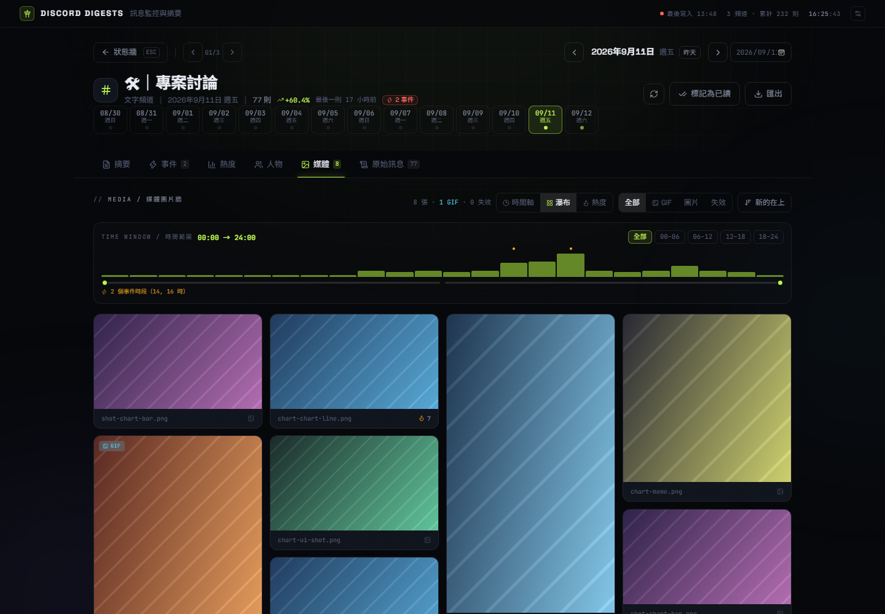
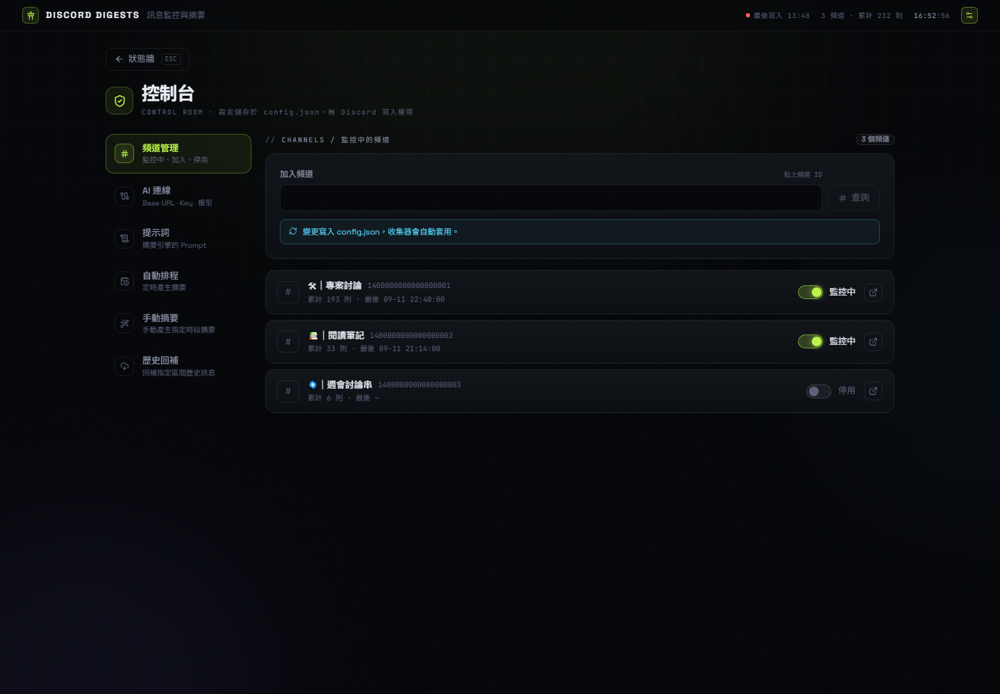
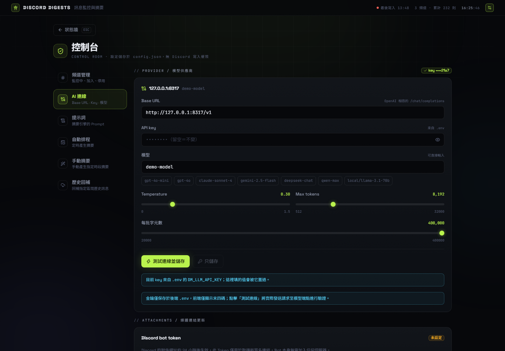
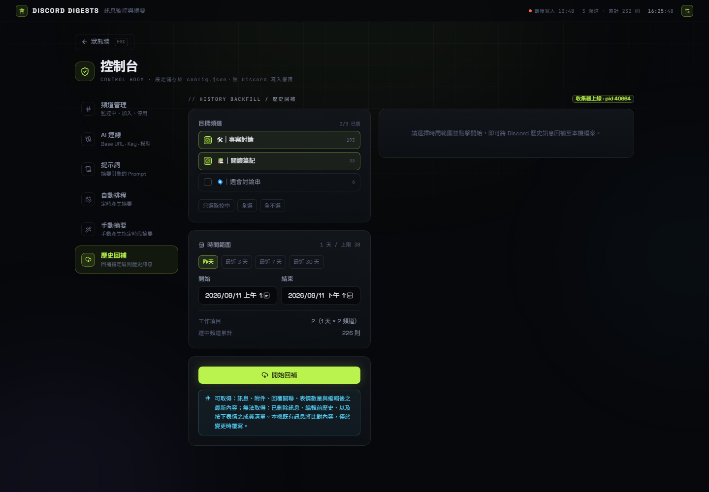

<div align="center">



# Discord Digests

**Discord 頻道訊息收集與每日摘要工具**

</div>

## ⚠️ 免責聲明與使用須知

- 本專案為個人本機工具，所有訊息與抓取紀錄皆存放於本機硬碟，不上傳至任何第三方。
- 使用 User Token 讀取訊息違反 Discord 服務條款，帳號有被停權的風險；建議使用免洗或測試帳號，風險由使用者自行承擔。
- 純讀取：沒有發言、編輯、刪除訊息或加入表情等功能。
- 工作台預設僅綁定 `127.0.0.1`，不對外開放。

## 主要功能

- **頻道狀態牆**：按日彙整各頻道的活動量、事件數量與摘要狀態，可切換日期。
- **每日摘要**：調用 LLM 自動整理當日對話重點，支援每日定時與手動指定時段兩種方式。
- **事件時間軸**：偵測關鍵字密集出現、表情反應暴增與訊息量突增，標記為事件並附上觸發的原始訊息。
- **媒體圖片牆**：集中瀏覽頻道歷史圖片與 GIF，支援時段篩選、GIF 篩選與新舊排序。
- **原始訊息**：所有統計與摘要皆由本機原始訊息計算，可一鍵跳回原文。
- **本機儲存**：訊息以每日 JSONL 保存並自動歸檔，附件僅記錄連結。

## 介面預覽

| 每日摘要 | 事件時間軸 |
| --- | --- |
|  |  |
| **媒體圖片牆** | **控制台 · 頻道管理** |
|  |  |

| 控制台 · AI 連線 | 控制台 · 歷史回補 |
| --- | --- |
|  |  |

> 截圖使用示範資料，頻道與訊息均非真實內容。

## 快速開始 (Getting Started)

### 1. 編譯

```bash
cd backend && go build -o ../discordwatch.exe .   # 後端
cd ../webui && npm install && npx vite build      # 工作台
```

工作台的建置產物由 `serve` 直接提供；改動後重新執行 `npx vite build` 即可，不需另外部署。

### 2. 設定

```bash
cp .env.example .env
cp config.example.json config.json
```

`.env` 共三個變數：

| 變數 | 用途 | 必要性 |
| --- | --- | --- |
| `DISCORD_TOKEN` | 讀取訊息用的 User Token | 必填 |
| `DISCORD_BOT_TOKEN` | 更新失效圖片連結用的 Bot Token | 選填 |
| `DM_LLM_API_KEY` | 摘要模型的 API Key | 選填 |

監控清單與模型設定位於 `config.json`，可直接以範例檔啟動。上述兩個檔案均已列入 `.gitignore`，請勿上傳。

### 3. 啟動

```bash
discordwatch.exe channels -add <channelId>   # 加入監控頻道
discordwatch.exe watch                       # 開始接收訊息
discordwatch.exe serve                       # 啟動工作台
```

工作台：<http://127.0.0.1:8787>。`watch` 需保持執行才能持續接收，重新連線後會自動補齊中斷期間的訊息。

## 常用指令

| 指令 | 說明 |
| --- | --- |
| `channels` | 列出伺服器與頻道，`-add` / `-remove` 修改監控清單 |
| `digest <channelId> [from] [to]` | 立即產生指定範圍的摘要，未指定則為整日 |
| `backfill <channelId> <from> <to>` | 回補歷史訊息至本機，單次上限 30 天 |
| `refresh` | 更新失效的圖片連結 |
| `rotate` | 將舊訊息歸檔壓縮 |
| `status` | 顯示各頻道的接收進度與累計數量 |

## 目錄與檔案說明

```
raw/<channelId>/     接收到的訊息與表情事件，含每日壓縮歸檔
reports/             產生的摘要（Markdown）
jobs/                排隊中的回補工作
watch.heartbeat      收集器心跳檔（超過 90 秒未更新即代表程序異常或中斷）
.env                 憑證（不進版控）
config.json          監控清單、模型設定、排程（不進版控）
```

資料根目錄預設為執行指令時所在的目錄，可用 `DM_HOME` 指定。

## 已知限制 (Limitations)

- 無法取得過舊的歷史訊息：Discord API 對歷史訊息的取得有時間限制，`backfill` 單次上限 30 天。
- 附件網址約 24 小時後失效，需設定 Bot Token 並執行 `refresh`（或於工作台點選「更新連結」）重新取得有效簽名。
- 無法補回已刪除的訊息與編輯前的內容；表情反應也不包含按下的人。
- 時間一律為 GMT+8。
